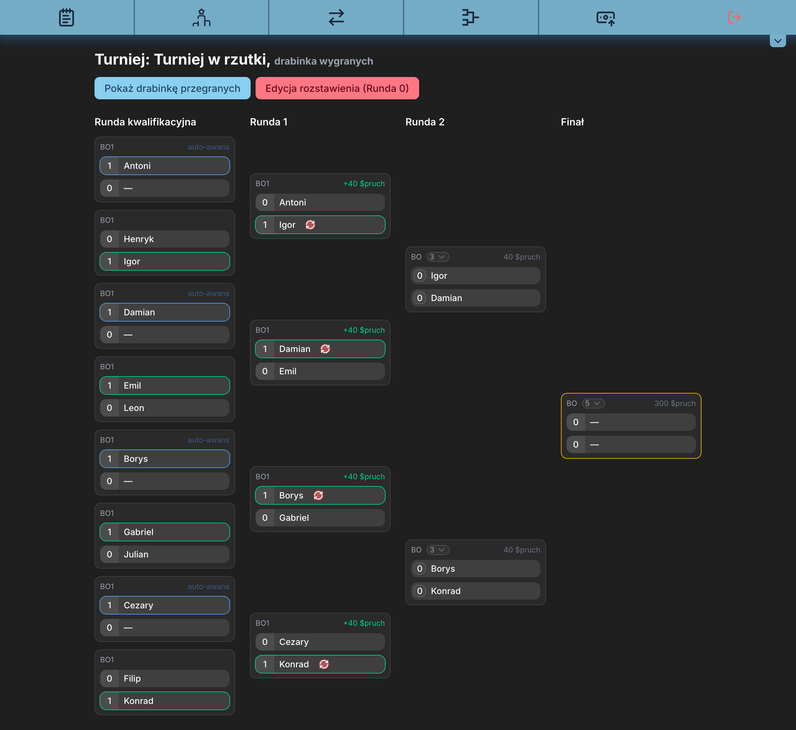
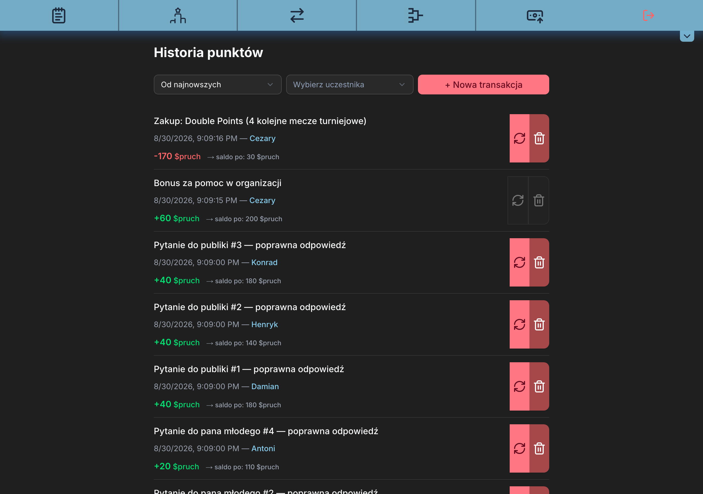
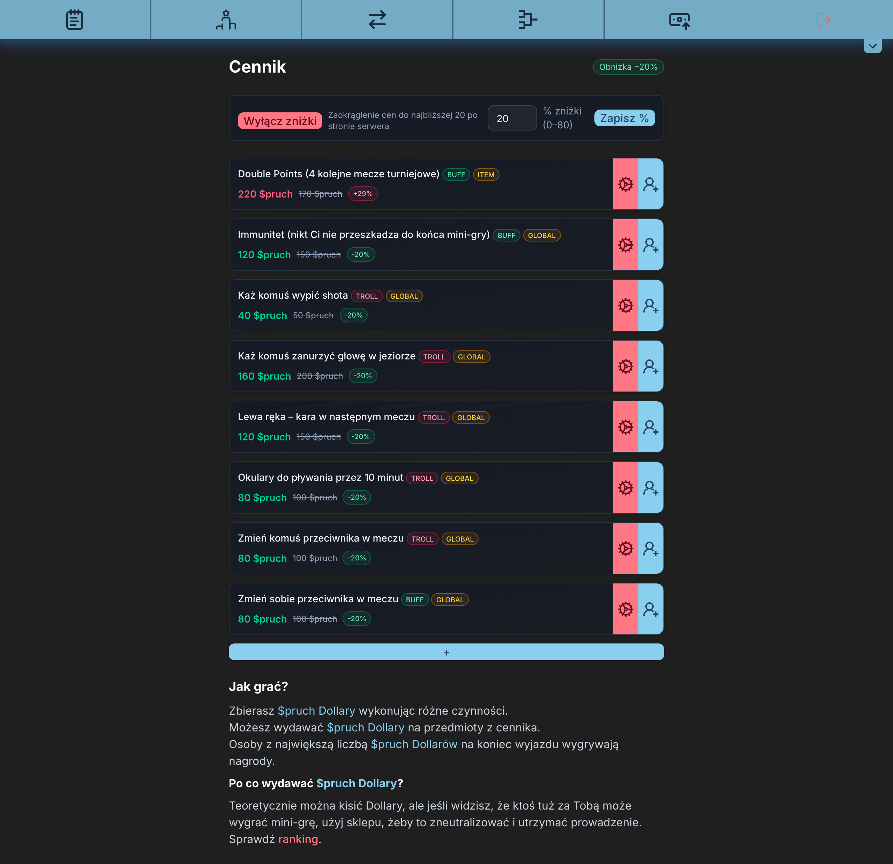
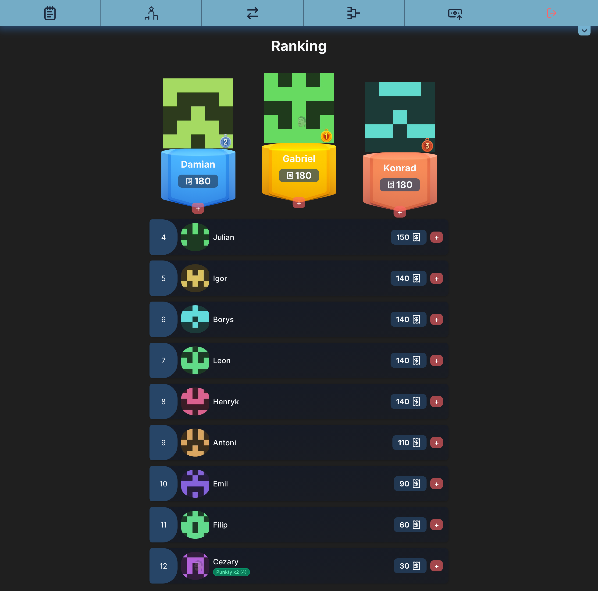
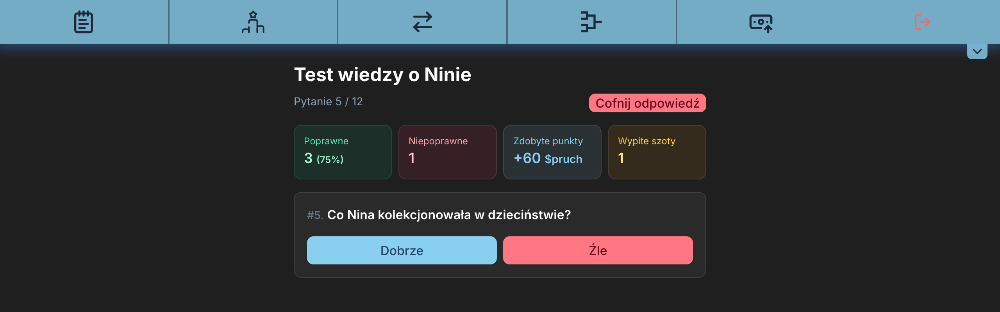
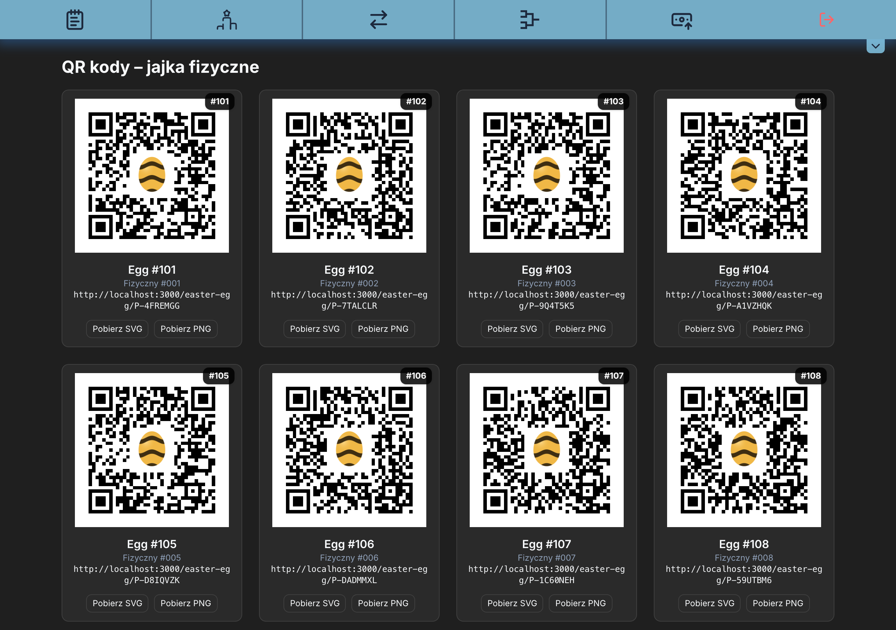

# Bachelor Companion

A companion web app for a bachelor party weekend: an in-app currency with a whole economy behind it,
a shop, tournaments with a double-bracket layout, 1v1 duels, a two-sided quiz and a hunt for hidden
easter eggs — all driven from a single admin panel while guests follow along on their phones.

Built as a real, used-in-anger side project. The interface is in Polish; the code and this document
are in English.

> All data in this repository is synthetic. Participant names, quiz questions and avatars are
> generated fixtures — see [Seed data](#seed-data).

## What is interesting in here

**A double-elimination bracket that survives odd player counts.** Tournaments seed players by
current balance into a standard bracket order (1v8, 4v5, 2v7, 3v6 …), pad the field with byes, then
auto-advance them. When the losers bracket is generated it computes how many play-in matches are
needed to get from an arbitrary number of losers down to a power of two, and wires `nextMatchId` /
`nextMatchSlot` pointers so results propagate forward on their own. Best-of escalates by round: 1
early, 3 in the middle, 5 in the final.



*Twelve players padded to sixteen slots: four auto-advanced byes in the qualifying round, per-match
payouts, and best-of rising to 5 in the final.*

**A ledger that always balances.** Every currency movement goes through a single `applyLedgerEntry`
helper that reads the balance, refuses to overdraw, writes a `Transaction` row carrying
`balanceAfter`, and updates the participant — all inside one database transaction. Because every
payout is tagged with its `matchId`, reverting a match, a duel or a whole tournament is the same
operation: net the entries per participant, verify nobody drops below zero, apply, delete.

**Reversibility as a first-class feature.** Scores get mis-entered at a party. Every scoring action
— match, duel, quiz answer, tournament deletion — can be undone, and undoing restores the
double-points buffs that the original action consumed.



*Every row carries the balance it produced. The greyed-out controls on the second entry are a
reversal the ledger refuses, because undoing it would push that participant below zero.*

**Purchasable sabotage.** The shop sells both buffs and troll items, with prices adjusted by a global
discount or a per-item override, then rounded to amounts the physical play-money can actually make
(no 10s or 30s — see `isReachableWithNotes`).



*A global −20% discount applies to everything except Double Points, where a per-item override wins
and pushes the price up instead. Each badge shows which rule produced the number.*

### The rest of it

| | |
|---|---|
|  |  |
| Standings with the podium and an active double-points buff. | The groom quiz, scored live, with an undo for the inevitable misclick. |



*Physical eggs get printable QR codes. The code for each egg is derived deterministically from its
number, so reseeding never invalidates something already printed and hidden.*

## Stack

| | |
|---|---|
| Framework | Next.js 15 (App Router, Turbopack), React 19 |
| Language | TypeScript (strict) |
| Data | PostgreSQL via Prisma 6 |
| Server state | TanStack Query 5 |
| UI | Tailwind CSS 4, Radix primitives, shadcn-style components |
| Validation | Zod 4 |
| Realtime | Pusher Channels |
| Tests | Vitest |

## Architecture

```
src/
  app/
    (public)/       guest-facing pages: shop, ranking, tournaments, duels, transactions
    admin/          admin panel: participants, easter eggs, QR codes, quiz control
    api/            route handlers, one thin file per endpoint
  server/
    api/            route helper, shared Zod schemas, response serialisers
    db/
      repositories/ direct Prisma queries
      services/     business rules: economy, tournaments, duels, quiz, easter eggs, pricing
    realtime/       Pusher publisher
  lib/              framework-agnostic logic: bracket maths, session tokens, API client
  components/       React components
```

Requests flow **route → service → repository**. Route handlers stay declarative because
`defineRoute` absorbs the repetitive parts:

```ts
export const POST = defineRoute({
    admin: true,
    params: idParams,
    body: z.object({winner: winnerSide, scoreA: score, scoreB: score}),
    handler: async ({params, body}) => {
        await reportDuel({id: params.id, ...body})
        return {ok: true}
    },
})
```

It resolves the params promise, validates params and body with Zod, enforces the admin session,
maps a thrown `AppError` to its status and turns anything unexpected into a logged 500 — so no
handler repeats a try/catch.

Services take an optional Prisma transaction client, so a caller that already opened a transaction
can pass it down instead of nesting a second one:

```ts
export function withTx<T>(fn: (tx: Tx) => Promise<T>, tx?: Tx, options?: {timeout?: number}) {
    return tx ? fn(tx) : prisma.$transaction(fn, options)
}
```

## Authentication

There is one shared admin password and no user accounts — the app is used by one operator on a
single weekend. Logging in sets an HTTP-only cookie holding an HMAC-SHA256 signed token with an
expiry claim, verified via Web Crypto so the same code runs in middleware (Edge) and in route
handlers. Protection is layered: middleware denies every non-GET API request except an explicit
public allowlist, and each route additionally declares `admin: true`.

## Demo mode

The app can run as a public demo where anyone may open the admin panel and break things, because the
database is rebuilt on a schedule. It is off unless `DEMO_MODE=true`, and the flag is read at
request time, so the same build behaves correctly in both roles.

Turning it on does three things: the login page grows a passwordless **enter as admin** button, a
banner tells visitors the data is fictional and resets, and `POST /api/demo/reset` starts accepting
calls. Everything else — including how destructive the admin panel is — stays exactly as it is in
production. That is the point: a read-only demo would hide the only part worth showing.

The reset wipes every table, re-seeds the fixtures, then replays a scripted scenario so a visitor
lands on something worth looking at rather than an empty shop: a 12-player tournament with two
rounds played and a losers bracket generated, purchases, a transfer, a claimed easter egg, quiz
answers, and a discount plus a per-item override so the pricing rules are visible. It is idempotent
— running it twice leaves the same numbers.

The endpoint is protected by `CRON_SECRET` as a bearer token and refuses to run without one. A
GitHub Actions workflow (`.github/workflows/demo-reset.yml`) calls it hourly; set the repository
secrets `CRON_SECRET` and `DEMO_RESET_URL`. On Vercel you can use a `vercel.json` cron entry
instead, though the Hobby plan limits cron to once a day.

```bash
curl -X POST -H "Authorization: Bearer $CRON_SECRET" https://your-demo-host/api/demo/reset
```

Never set `DEMO_MODE=true` on an instance holding data you care about — the reset is destructive by
design, and the admin panel is unauthenticated.

## Running locally

Requires Node 20+ and a PostgreSQL database.

```bash
npm install
cp .env.example .env        # then fill in the values
npx prisma migrate deploy   # or: npm run db:migrate
npm run db:seed
npm run dev
```

The app runs at http://localhost:3000; the admin panel is at `/admin`.

`SESSION_SECRET` must be at least 32 characters — the app refuses to issue sessions otherwise:

```bash
openssl rand -base64 48
```

Pusher is optional. Without it the app works normally; only the live "someone found an egg" toast
stays quiet.

## Scripts

| Command | |
|---|---|
| `npm run dev` | development server |
| `npm run build` | production build |
| `npm test` | run the test suite |
| `npm run test:watch` | tests in watch mode |
| `npm run test:coverage` | coverage report |
| `npm run typecheck` | `tsc --noEmit` |
| `npm run lint` | ESLint |
| `npm run db:migrate` | apply migrations |
| `npm run db:seed` | seed the database |
| `npm run db:reset-demo` | wipe and rebuild the demo scenario |

## Tests

Vitest covers the logic that is worth protecting and can run without a database: bracket
construction and seeding order, price rounding, session token signing and expiry, the route
helper's validation and authorisation, the API client's error handling, the ledger rules
(overdraft refusal, reversal netting) against an in-memory stand-in for the Prisma client, and the
demo endpoints staying dead unless `DEMO_MODE` is exactly `true`.

```bash
npm test
```

## Seed data

The seed creates twelve fictional participants (Antoni … Leon), a shop, prizes, quiz questions for a
fictional couple, and the easter eggs. Every image in the repository is generated rather than
photographed: avatars are deterministic identicons derived from the participant's name, and the
easter egg icon is drawn procedurally.

```bash
node scripts/generate-avatars.mjs antoni borys cezary
node scripts/generate-egg-icon.mjs
```

Easter egg codes are derived deterministically from the egg number, so the same seed always yields
the same printable codes. `/admin/qr` renders them as QR codes for printing.
